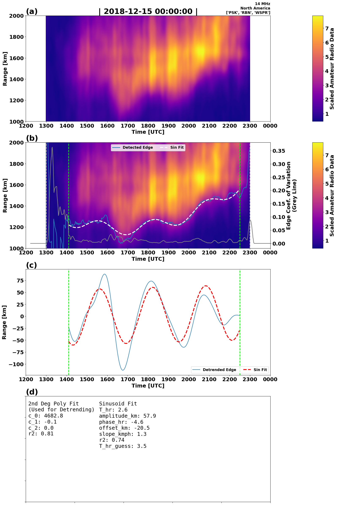

# hamsci_LSTID_detection
[](https://zenodo.org/doi/10.5281/zenodo.13630866)
Code for automatically detecting Large Scale Traveling Ionospheric Disturbances (LSTIDs) from ham radio spot data.

Developed by the HamSCI NASA Space Weather Operations to Research (SWO2R) Team with major contributions by:

* Nathaniel Frissell W2NAF
* Nicholas Callahan
* Diego Sanchez KD2RLM
* Bill Engelke AB4EJ
* Mary Lou West KC2NMC

# Requirements
This code was tested on an x86 Ubuntu 22.04 LTS Linux machine with python v3.11.9 and the following libraries:
```
dask==2024.5.0
matplotlib==3.8.4
numpy==2.1.0
pandas==2.2.2
scipy==1.14.1
statsmodels==0.14.2
xarray==2023.6.0
```

# Instructions
1. Clone GitHub Repository
2. `pip install -e .`
3. Place raw spot data files into `raw_data` directory.
    1. Raw spot data should be bzip2 compressed daily files.
    2. Names should be in the form of: `2018-11-01_PSK.csv.bz2`, `2018-11-01_RBN.csv.bz2`, and `2018-11-01_WSPR.csv.bz2`, etc.
    3. Data files for 1 November 2018 - 30 April 2019 are available from https://doi.org/10.5281/zenodo.10673982. Due to Zenodo file number limitations, data files in this repository are combined into one *.tar file for each month.
4. Edit parameters in the top of `run_LSTID_detection.py`.
5. Run `./run_LSTID_detection.py`

# Notes
Using multiprocessing on a 64-thread machine with 512 GB RAM, this code takes about 12 minutes to process the 1 November 2018 - 30 April 2019 data from https://doi.org/10.5281/zenodo.10673982.

# Full Algorithm Description
## 1. Data Loading and Gridding
Data Loading and Gridding is handled by `hamsci_LSTID_detect.data_loading.RawSpotProcessor()`.

1. For each day, RBN, PSK, and WSPRNet spot data is combined into a single data frame.
2. Data is filtered based on frequency, TX-RX midpoint location, and TX-RX ground range. For Frissell et al. (2024, GRL), the following filters are used, which corresponds to 14 MHz signals over North America:
    1. 20$^{\circ}$ < lat < 60$^{\circ}$
    2. -160$^{\circ}$ < lon < -60$^{\circ}$
    3. 14 MHz < f < 15 MHz
    4. 0 km < R_gc < 3000 km
3. Filtered data is gridded into 10 km range by 1 minute bins.

## 2. Gridded Array Re-scaling
Gridded array re-scaling is handled by `hamsci_LSTID_detect.data_loading.create_xarr()`.

1. Data array is trimmed so that only daylight hours in North America are used (1200-2359 UTC).
2. A scaled version $M_{ad}$ of the gridded array $A$ is computed by `hamsci_LSTID_detect.data_loading.mad()` as follows:
$$M_{ad} = \frac{|A-\mbox{Med}(A)|}{\mbox{max}(\mbox{Med}(A),0.05)}$$

## 3. Skip Distance Edge-Detection
Skip distance edge-detection is handled by `hamsci_LSTID_detect.edge_detection.run_edge_detect()`.

1. The x- and y- dimensions of the gridded array are trimmed by 8%.
2. A `scipy.ndimage.gaussian_filter()` with $\sigma=(4.2, 4.2)$ is applied to the gridded array.
3. The gridded array has the minimum subtracted from the array so the lower bound is 0.
4. A maximum of the gridded array, excluding upper outliers, is taken by selecting the value of the `occurence_max=60`th pixel's largest value.
5. The gridded array is re-scaled by the maximum and `i_max=30` values so that the outlier adjusted maximum is re-scaled to 30, and all float values are rounded to integers, so the array consists of approximately 30 discrete thresholds.
6. For each unique value in the integer array, a lower threshold line is calculated by taking the index of the lowest point in each column such that the value at that point is greater than the threshold.
7. All thresholds for the integer array are stacked vertically, and threshold values below a specified y location are set to `np.nan`.
8. Column-wise, for each value `q` in `qs=[.4,.5,.6]`, a scalar value is selected to represent the column as the detected edge by selecting the `q`th quantile value with nans ignored.
9. Using the edges for each value in `[.4,.5,.6]`, each edge has outlier points removed, where any point that deviates more than `max_abs_dev=20` vertical pixels from the smoothed edge is interpolated with `scipy.interpolate.CubicSpline`.
10. After outlier removal, the edge with the lowest standard deviation against the smoothed and interpolated version of the edge is returned as `min_line` and `minz_line`, in the original and smoothed form respectively.
11. `min_line` is returned as the raw detected edge for the image, along with the unselected edges corresponding to the `qs`, and the `minz_line` for comparison.

## 4. Sine Fitting
A theoretical sinusoid is fit to the detected edge by `hamsci_LSTID_detect.edge_detection.run_edge_detect()`.

1. A 15 minute rolling coefficient of variation $CV = \sigma/\mu$ is computed on the raw detected edge for use as a quality parameter.
2. The largest contiguous time period between 1330 and 2230 UTC where $CV < 0.5$ is selected as "good".
3. A 2nd-degree polynomial is fit to the good period.
4. The raw detected edge within this time period is detrended using a least-squares best-fit second degree polynomial.
5. A $1 < T < 4.5$ hr band-pass filter is applied to the detrended edge.
6. This filtered, detrended result is curve-fit to $$A\sin(2\pi ft+\phi) + mt +b$$ to determine the LSTID amplitude $A$ and period $T=1/f$.
     1. `scipy.optimize.curve_fit()` is used as the curve fitter.
     2. The curve fit routine is run for each of the following initial period guesses: $T_{hr}$ = [1,1.5,2,2.5,3,3.5,4].
     3. Other parameter initial guesses are as follows:
        - `guess['amplitude_km']   = np.ptp(data_detrend)/2.`
        - `guess['phase_hr']       = 0.`
        - `guess['offset_km']      = np.mean(data_detrend)`
        - `guess['slope_kmph']     = 0.`
     4. The fit with the highest $r^2$ value is selected as the best fit.
  
# Example Daily Output


Figure 1 shows LSTID automatic detection plot for 15 December 2018.

- Panel (a): Heatmap of re-scaled, smoothed, and thresholded RBN, PSKRepoter, and WSPRNet data as a function of communications ground range versus time. Only 14 MHz band data with communications midpoints over the US (20$^{\circ}$ < lat < 60$^{\circ}$ and -160$^{\circ}$ < lon < -60$^{\circ}$) are used. Data are gridded in 10 km x 1 min bins.
- Panel (b): Heatmap data from (a) with algorithm fit overlays. Blue line is raw detected edge; white dashed line is the final sinusoid fit with the trend added back in. Gray line is the 15-minute rolling coefficient of variation quality parameter. Green dashed vertical lines mark the start and end times used for curve fitting.
- Panel (c): Blue line is the detrended, band-pass filtered detected edge. Red dashed line is the sinusoid fit to the detrended edge. Green dashed vertical lines mark the start and end times used for curve fitting.
- Panel (d): Curve-fit parameters for the 2nd degree polynomial detrend fit and the sinusoid curve fit.

# Acknowledgments
This work was supported by NASA Grants 80NSSC21K1772, 80NSSC23K0848 and United States National Science Foundation (NSF) Grant AGS-2045755.
